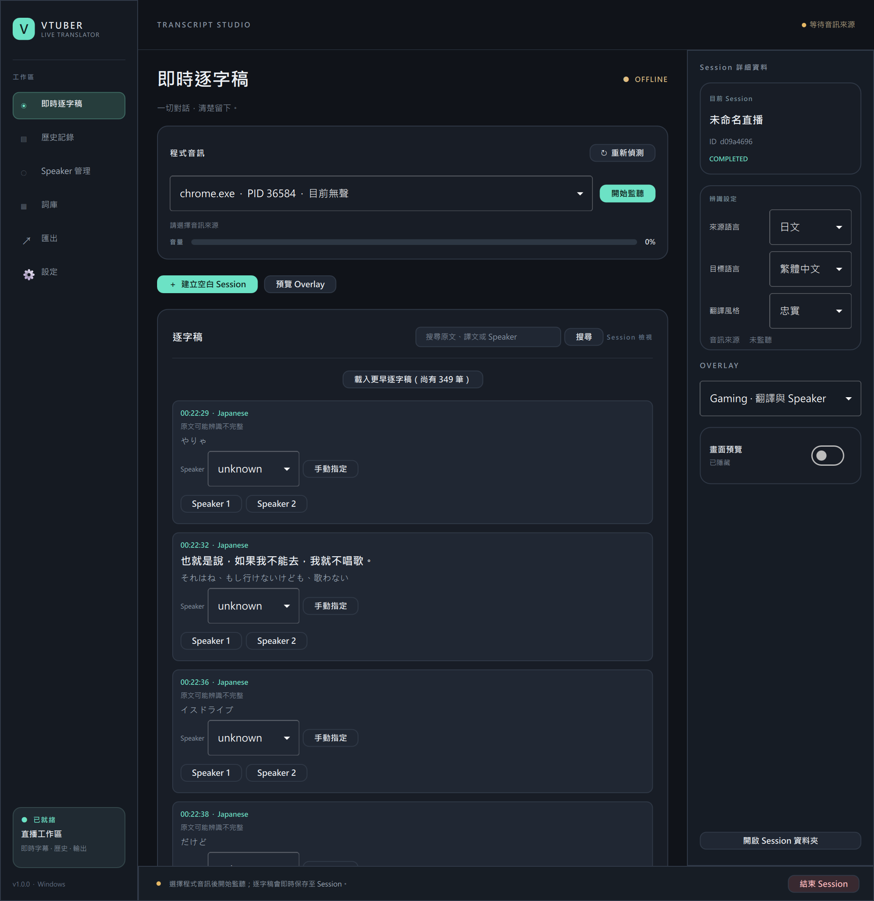
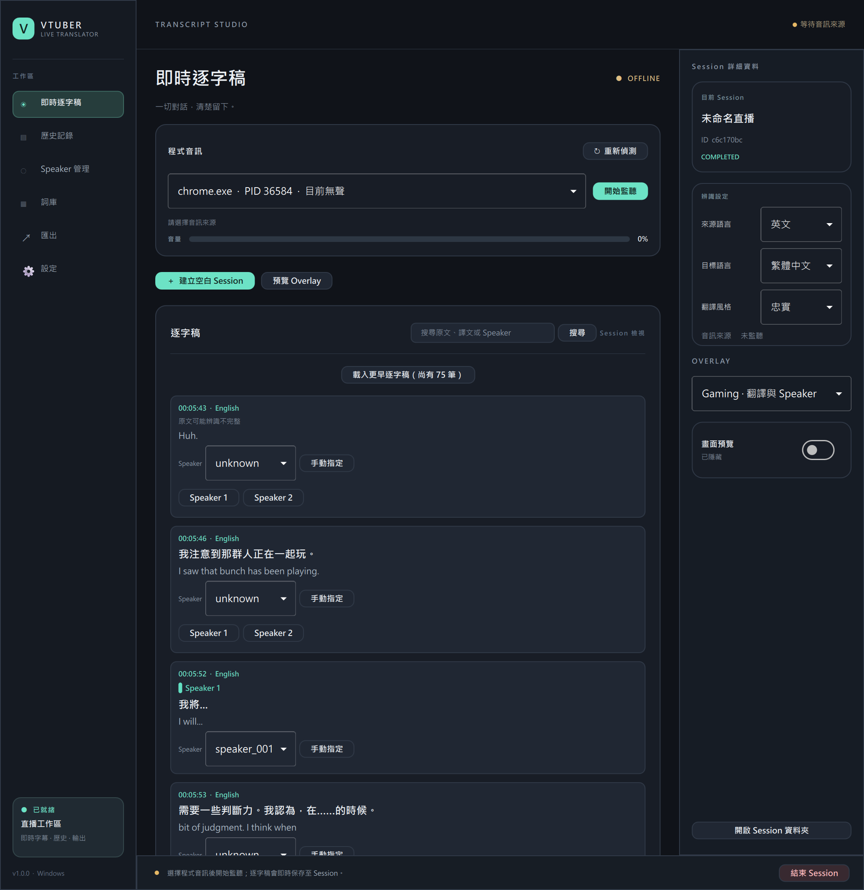
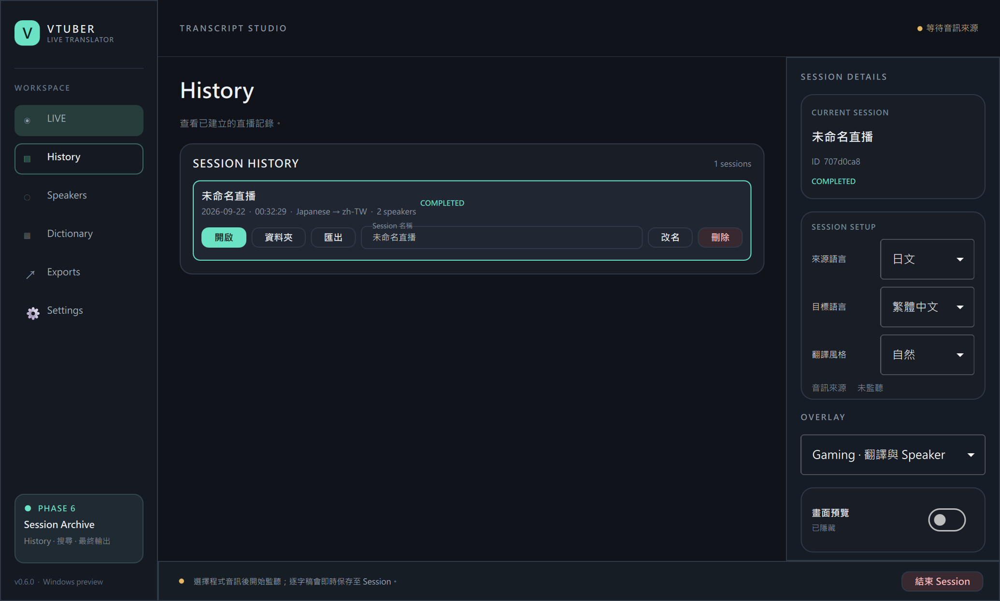
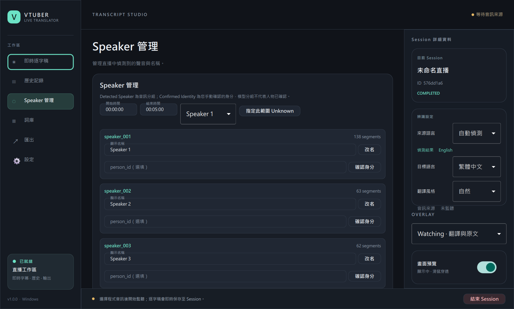

# Vtuber Live Translator

**選取 Windows 程式的音訊，即時產生日文／英文逐字稿與中文字幕。** 逐字稿可恢復、修正 Speaker 並匯出 Markdown、SRT、VTT。

> **1.0.0 Release Candidate · 尚未通過 GA 驗收。** 這裡展示的是實際測試畫面，辨識與翻譯可能出錯；目前沒有公開安裝檔。

## 看得到的工作流程

**選 Chrome 等音訊來源 → 查看原文與譯文 → 用 Overlay 看字幕 → 從 History 找回紀錄。** 原始音訊預設不存檔，Final 逐字稿在直播中持續保存到本機。

### Transcript Studio

*日文公開直播測試的已完成 Session。每筆卡片顯示原文、中文譯文、Session 時間與 Speaker 狀態；無法確認時保留 Unknown。點圖可放大。*

*英文測試 Session；原文與譯文並列。短句可能沒有可靠譯文，不會把缺失藏起來。*

### Overlay 字幕

*Minimal 模式只顯示目前譯文；另有 Gaming（譯文與 Speaker）及 Watching（譯文與原文）模式。*

### 可找回與修正的紀錄

| History | Speaker 管理 |
| --- | --- |
|  |  |
| 開啟、改名、找到資料夾及重新匯出 Session。 | 暫定 Speaker 可改名或手動修正；Unknown 不會冒充已確認人物。 |

*截圖橫跨 v0.6 預覽版與 v1.0.0 候選版，並非同一次直播或正式 GA 宣傳圖。畫面中的譯文未經人工逐句校對。[查看截圖與紀錄說明](docs/interface-and-records.md)。*

## 使用前先知道

- **環境：**Windows 11／Windows Server 2022 build 20348 以上；首次使用需下載約 2.45 GB 模型與執行元件，建議保留至少 7 GB 空間。
- **隱私：**正常 Session 的音訊、逐字稿與翻譯在本機處理；原始音訊預設不落盤，沒有遙測上傳。
- **限制：**多人重疊、短句、音效可能影響辨識與 Speaker 分組；中文翻譯可能延遲、漏譯或產生錯誤事實，重要內容請核對原文。乾淨 Windows 與真實遊戲全流程仍待驗收。
- **授權：**目前原創程式碼與素材保留權利；歷史提交曾有 MIT 授權文字。第三方元件依其各自授權。詳見 [LICENSE.txt](LICENSE.txt) 與 [THIRD_PARTY_NOTICES.txt](THIRD_PARTY_NOTICES.txt)。

## 深入閱讀

[安裝與開發技術說明](docs/technical-guide.md) · [介面與本機紀錄](docs/interface-and-records.md) · [ASR 量測](ASR_ACCURACY_REPORT.md) · [Phase 9 驗證與 GA 限制](PHASE9_REPORT.md) · [Phase 10B 翻譯測試](PHASE10B_REPORT.md)
