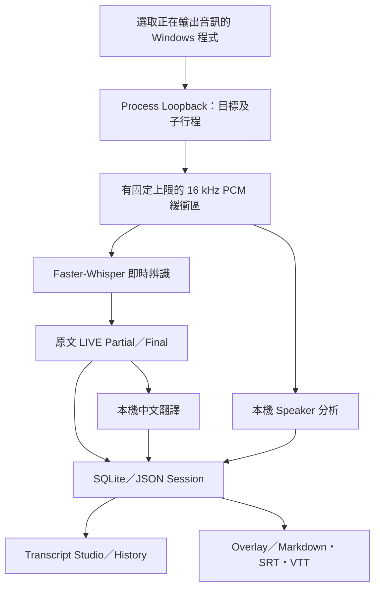

# Vtuber Live Translator


**Windows 即時外語直播逐字稿與中文字幕工作台** · 1.0.0 Release Candidate

選取正在發聲的 Windows 程式（例如 Chrome），從該程式及其子行程擷取音訊，產生日文／英文逐字稿、繁體／簡體中文翻譯與可置頂字幕。Session 持續保存，能在中斷後恢復、修正 Speaker 並匯出字幕。

> **目前尚未通過 GA 驗收，也沒有公開安裝檔。** 下列畫面來自不同開發驗證階段的真實測試 Session；譯文未經逐句人工校對。

[介面展示](#介面展示) · [系統流程](#系統流程) · [工程重點](#工程重點) · [驗證結果](#驗證結果與限制) · [開發啟動](#開發啟動) · [詳細文件](#文件導覽)

## 介面展示

| 日文 Transcript Studio | 英文 Transcript Studio |
| --- | --- |
| <a href="assets/screenshots/studio-japanese.png"></a> | <a href="assets/screenshots/studio-english.png"></a> |
| 原文、譯文、Session 時間與暫定 Speaker 顯示在同一筆紀錄。 | 來源語言可選 Auto、Japanese、English；譯文未完成時保留原文。 |

| Overlay：Minimal 模式 | History：已完成 Session |
| --- | --- |
| <a href="assets/screenshots/overlay-minimal.png"></a> | <a href="assets/screenshots/history-phase6.png"></a> |
| 置頂字幕另有 Gaming、Watching 模式；Minimal 僅顯示目前譯文。 | 可開啟、改名、找到資料夾及重新匯出；此圖攝於 v0.6 預覽版。 |

<a href="assets/screenshots/speakers.png"></a>

*Speaker 管理：模型分組不等於真實人物身分；不確定或重疊的語音保留 Unknown，可由使用者修正。圖片可點擊放大。[查看每張圖的版本與紀錄說明](docs/interface-and-records.md)。*

## 系統流程



只處理選取程式的音訊；原始音訊預設不寫入硬碟。ASR、翻譯或 Speaker 暫時不可用時，已確認的原文仍應保存，未完成的翻譯標成 `translation_pending`。

## 工程重點

| 領域 | 實作與設計 |
| --- | --- |
| 指定程式音訊 | Windows Application/Process Loopback 擷取目標程序樹，不以整機 Stereo Mix 作主方案。 |
| 即時逐字稿 | Faster-Whisper；partial 更新同一筆 LIVE 項目，Final 帶 Session 相對時間並立即保存。 |
| 中文翻譯 | 本機 Ollama backend，支援 zh-TW／zh-CN、風格與詞庫；翻譯失敗不阻塞原文紀錄。 |
| Speaker | sherpa-onnx 本機分析；暫定 ID、Unknown 與人工修正分開呈現。 |
| 有界資源 | 音訊、ASR、翻譯佇列都有固定上限；長時間直播不讓緩衝區無限增長。 |
| 保存與匯出 | SQLite 為正式紀錄，另更新 JSON；History 可恢復 Session，並產生 Markdown／SRT／VTT。 |
| 桌面介面 | PySide6／QML Dark Theme；Overlay 提供 Gaming、Watching、Minimal 三種顯示模式。 |

主要技術：**Python · PySide6/QML · Windows Process Loopback · Faster-Whisper/CTranslate2 · sherpa-onnx · SQLite · Ollama · Inno Setup**。

## 驗證結果與限制

- 截至 **2026-10-03**，完整自動化測試 **463 項通過**；實際測試範圍與條件見[報告](ASR_ACCURACY_REPORT.md)。
- FLEURS 每語言 80 段乾淨朗讀語音：base ASR Final 改用 beam 3 後，日文 CER **26.58% → 23.31%**，英文 WER **11.79% → 10.15%**。這些數字**不是直播準確率**。
- Windows 開發機已完成打包 EXE 啟動測試；獨立乾淨 Windows 安裝、長時間遊戲及 Overlay 實體操作仍待驗收。
- 中文翻譯可能漏譯或加入原文沒有的事實，重要內容請核對原文。多人重疊、短句與音效也可能讓 Speaker 顯示 Unknown。

因此此專案仍是 **Release Candidate，GA READY: NO**。詳見 [Phase 9 GA gate](PHASE9_REPORT.md)、[Phase 10 翻譯可靠性](PHASE10_REPORT.md)與 [Phase 10B 模型比較](PHASE10B_REPORT.md)。

## 開發啟動

**需求：**Windows build 20348+、Python 3.12+。正式安裝版規劃由 First Run 下載模型；目前未提供公開 Installer。若要從原始碼試跑，請依[完整開發說明](docs/technical-guide.md)準備本機模型與依賴：

```powershell
py -3.12 -m venv .venv
.\.venv\Scripts\python.exe -m pip install -e ".[dev]"
ollama pull qwen2.5:1.5b
.\.venv\Scripts\python.exe -m vlt.app
```

在 Studio 選擇正在發聲的 `chrome.exe` 等來源、設定來源與目標語言，再按「開始監聽」。Final 逐字稿保存在 `%LOCALAPPDATA%\VtuberLiveTranslator`；原始音訊預設不存檔。首次模型與 runtime 下載需要網路，正常本機 Session 不需將語音送到外部 AI 服務。

## 文件導覽

| 想了解 | 文件 |
| --- | --- |
| 截圖版本、History、Speaker 與本機紀錄格式 | [介面與紀錄](docs/interface-and-records.md) |
| 安裝、設定、音訊／ASR／翻譯／Speaker 實作與建置 | [技術說明](docs/technical-guide.md) |
| 辨識量測方法與誤差範圍 | [ASR 準確度報告](ASR_ACCURACY_REPORT.md) |
| Release Candidate 與 GA 缺口 | [Release Notes](RELEASE_NOTES_1.0.0.md) · [Phase 9 報告](PHASE9_REPORT.md) |

## 授權與致謝

本專案由 **CHEN, KUEI-HENG** 提出需求與驗收方向，開發過程使用 AI 輔助程式設計。現行原創材料保留權利；歷史提交曾包含 MIT 授權文字。第三方程式庫與模型依各自授權，見 [LICENSE.txt](LICENSE.txt) 與 [THIRD_PARTY_NOTICES.txt](THIRD_PARTY_NOTICES.txt)。

**English summary:** A Windows research prototype for process-specific live audio capture, Japanese/English transcription, local Chinese translation, speaker status, persistent sessions, and an overlay. The project is a release candidate; translation reliability and independent GA validation remain open.
